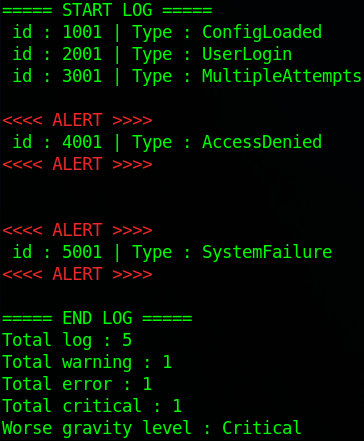

It's been 6 days since I started learning Rust.

## Objectives

The program is designed to serve as a Windows log analyzer.

## Actually

Currently, the program contains hardcoded fake logs to simulate future logic.

## Screenshot

